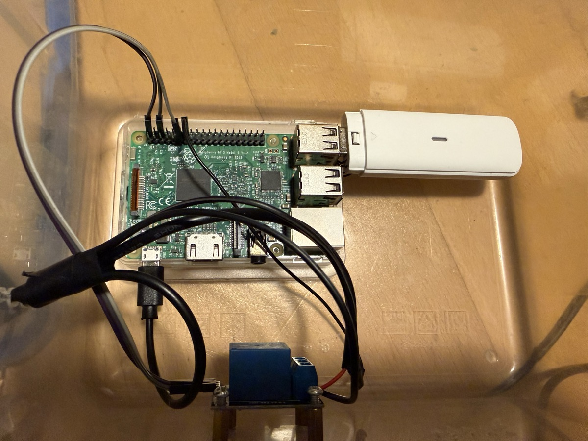
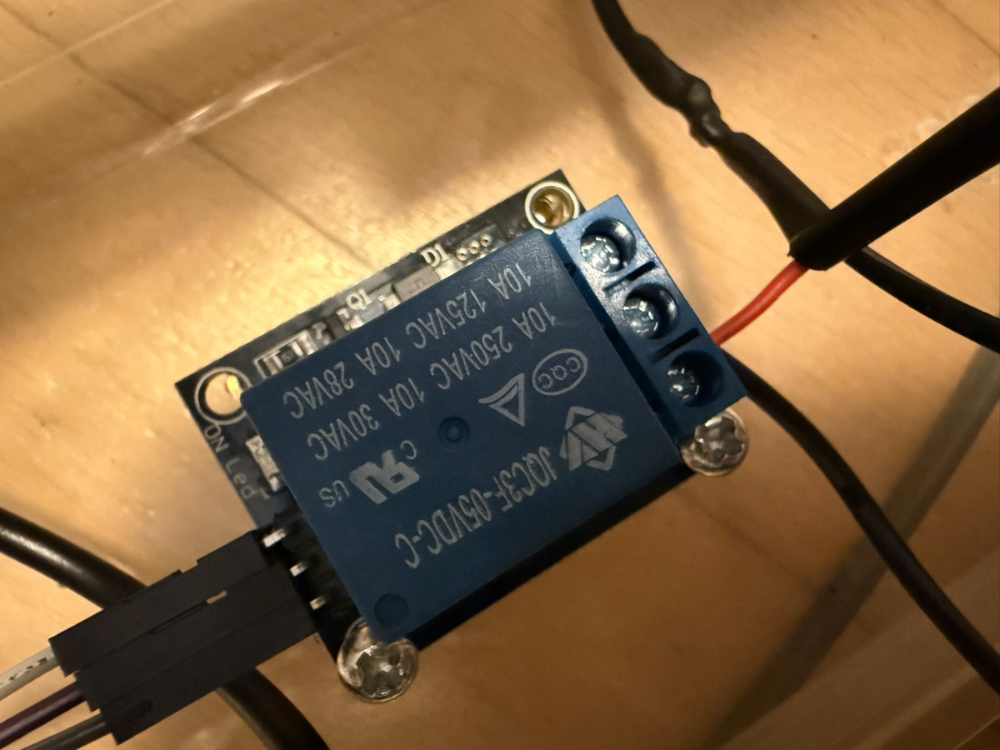
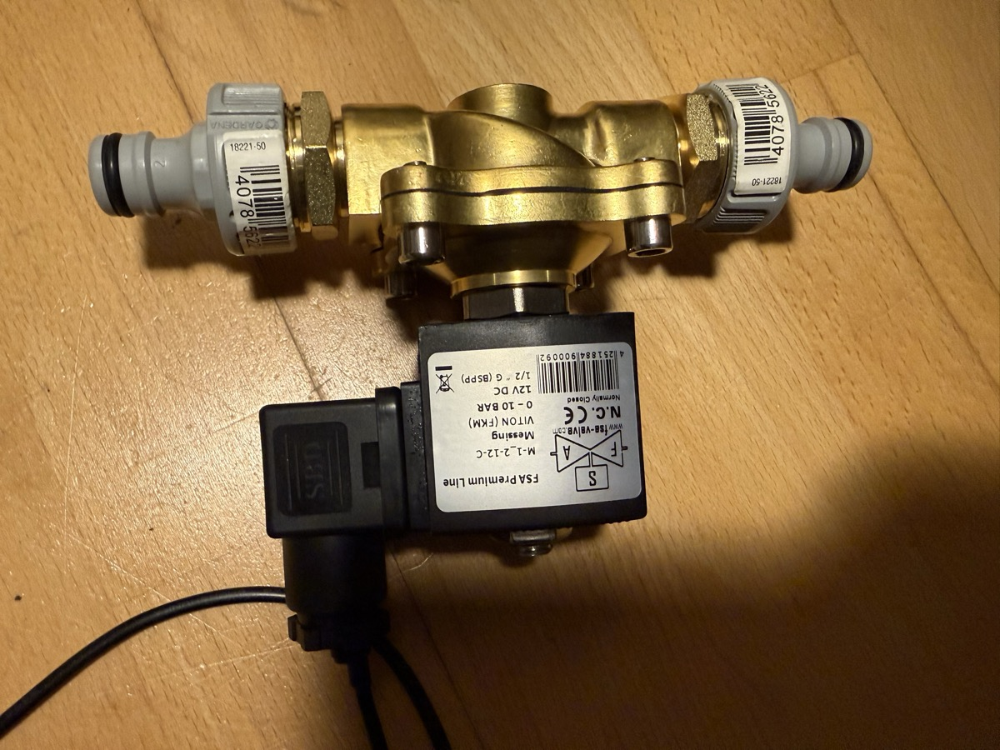
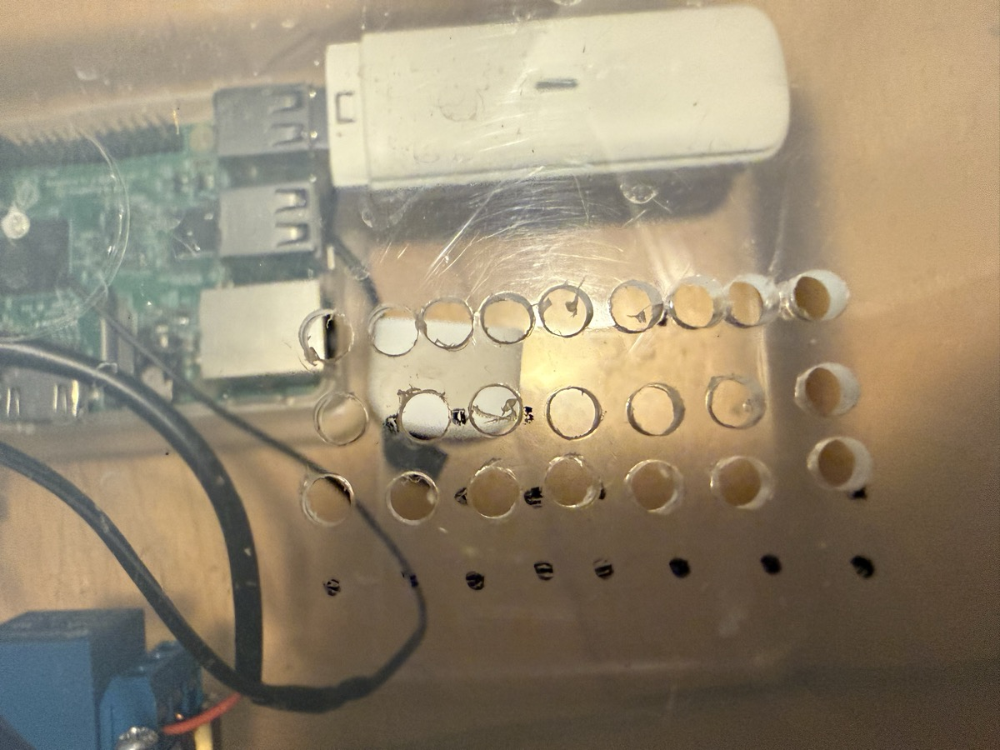
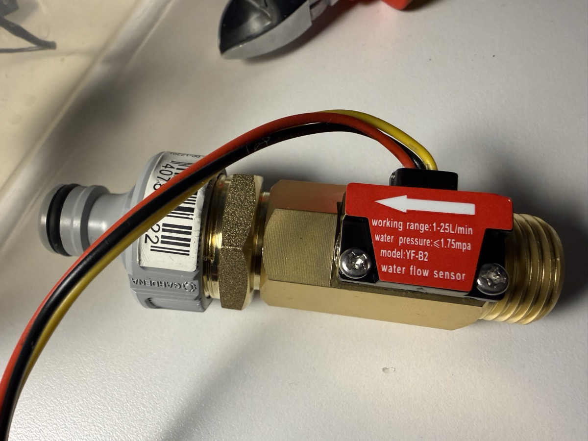

# Irrigator

Raspberry Pi-based garden irrigation controller with a Telegram bot interface. Built for a 10m x 2.5m driveway lawn seeding project — keeps freshly seeded lawn moist during the ~3 week germination period.

The system runs on a Raspberry Pi 3B with LTE cellular connectivity (no WiFi at the deployment site), controlled remotely via Telegram or SSH over Tailscale VPN.

## Why Rust?

The natural choice for someone coming from ML/data science would be Python — rich ecosystem, quick to prototype, plenty of GPIO and Telegram libraries. But this runs unattended on a Pi 3B at a remote site with no WiFi, powered over LTE. It needs to run for weeks or months without restarts, survive power outages, and not waste the 1GB of RAM on a runtime.

Rust gives us a single static binary (~10MB), no runtime dependencies, no GC pauses, and predictable memory usage. The Pi OS was stripped down to the bare minimum — no desktop, no X server, no browser. Total system memory usage including the OS, Tailscale, and the irrigator daemon: **124MB out of 906MB**. The irrigator daemon starts automatically via systemd on boot, so after a power outage the Pi just comes back up and resumes watering. You get a Telegram notification when it does.

## How It Works

A solenoid valve controls water flow from an outdoor tap through two soaker hoses. The Pi toggles the valve via a relay on GPIO 17. You control everything through Telegram:

```
/on 10       — open valve for 10 minutes
/off         — close valve
/status      — valve state, uptime, next scheduled watering
/schedule    — show current schedule
/set 06:00,8 10:00,8 14:00,8 18:00,8 — set watering times
/enable      — enable schedule
/disable     — disable schedule
/help        — list commands
```

A scheduler runs watering slots automatically (default: 4x daily, 8 minutes each). Every valve open has a max duration timer (default 120 min) to prevent flooding if connectivity is lost.

## Photos

| | |
|---|---|
|  |  |
| Pi 3B + LTE dongle + relay in enclosure | KY-019 relay wiring detail |
|  |  |
| FSA brass valve with Gardena adapters | Ventilated enclosure with plastic wrap weatherproofing |
|  | |
| YF-B2 flow sensor with Gardena adapter | |

## Hardware

| Component | Model |
|---|---|
| Computer | Raspberry Pi 3 Model B |
| LTE Dongle | ZTE MF833U1 |
| Relay | AZDelivery KY-019 5V 1-channel |
| Solenoid Valve | FSA brass 3/4" 12V DC, normally closed, direct-acting, 0-10 bar |
| Flow Sensor | YF-B2 brass Hall-effect, 1-25 L/min, G1/2" |
| Sprinklers | 2x Gardena Perl-Regner 15m soaker hose |

### Choosing a Solenoid Valve

Get a **brass, direct-acting** valve. Avoid cheap plastic valves — they tend to be unreliable and poorly sealed.

Key specs to look for:
- **12V DC** — safe for outdoor DIY use. Avoid 230V AC (dangerous around water, VDE regulations apply in Germany).
- **Normally closed (NC)** — valve closes when power is off. This is a safety requirement.
- **Direct-acting** — opens with just the solenoid, no water pressure needed. Pilot-operated valves require minimum pressure and won't work dry (can't test on your desk).
- **0 bar minimum pressure** — confirms it's truly direct-acting.
- **1/2" or 3/4" G thread** — either works. The valve has female threads, so you'll need male-to-male adapters (e.g., 1/2" to 3/4") to connect Gardena adapters on each side.
- **IP65 or better** — for outdoor use.

Actual power draw may be lower than rated. Our FSA valve is rated 20W but measures 20Ω, so actual draw is ~0.6A / 7.2W at 12V. The watt rating is the max the coil can dissipate, not actual consumption. A 12V 2A PSU is sufficient.

### Wiring

```
[5V/3A USB Charger] → [Raspberry Pi 3B]
                          │
                     GPIO 17 (Pin 11) → Relay S (signal)
                     5V    (Pin 2)  → Relay + (VCC)
                     GND   (Pin 6)  → Relay - (GND) + 12V PSU GND (common ground!)

[12V 2A PSU] → Relay COM
               Relay NO → Solenoid Valve (+)
                          Solenoid Valve (−) → 12V PSU GND

Add 1N4007 flyback diode across solenoid terminals (cathode to +12V side).

[YF-B2 Flow Sensor] (Hall-effect, 3 wires)
  Red    → 5V (Pin 4)
  Black  → GND (Pin 6)
  Yellow → GPIO 22 (Pin 15) — pulse output, use internal pull-up
```

### Flow Sensor

The YF-B2 is a brass Hall-effect water flow sensor (1-25 L/min, ≤1.75 MPa). It outputs digital pulses as water flows through — each pulse corresponds to a fixed volume. The Pi counts pulses on GPIO 22 to measure flow rate and total volume. Calibrated to ~617 pulses per liter (the datasheet says ~450, but actual calibration with a 7L bucket showed otherwise).

During watering, the daemon sends periodic Telegram updates (every 2 minutes or every 5L) and a final total when the valve closes.

The sensor's signal pin is open-collector, so it needs a pull-up resistor. Instead of an external 10kΩ resistor, we use the Pi's built-in GPIO pull-up (`into_input_pullup()` in rppal). Install it after the valve, between valve and soaker hoses.

### GPIO Pinout

The `1` on the board marks Pin 1. Odd pins are on the inner row (closer to the board center), even pins on the outer row (closer to the board edge).

```
J8 Header (top view, active USB ports on the right):

   3V3  (1) (2)  5V
 GPIO2  (3) (4)  5V
 GPIO3  (5) (6)  GND
 GPIO4  (7) (8)  GPIO14
   GND  (9) (10) GPIO15
GPIO17 (11) (12) GPIO18
GPIO27 (13) (14) GND
GPIO22 (15) (16) GPIO23
   3V3 (17) (18) GPIO24
GPIO10 (19) (20) GND
 GPIO9 (21) (22) GPIO25
GPIO11 (23) (24) GPIO8
   GND (25) (26) GPIO7
 GPIO0 (27) (28) GPIO1
 GPIO5 (29) (30) GND
 GPIO6 (31) (32) GPIO12
GPIO13 (33) (34) GND
GPIO19 (35) (36) GPIO16
GPIO26 (37) (38) GPIO20
   GND (39) (40) GPIO21
```

**Relay connections** (KY-019 has a 3-pin header with S, +, -):

| Relay Pin | Pi Pin | Pi Label | Location |
|---|---|---|---|
| **+** (VCC) | Pin 2 or Pin 4 | 5V | 1st/2nd row, outer |
| **-** (GND) | Pin 6 | GND | 3rd row, outer |
| **S** (Signal) | Pin 11 | GPIO17 | 6th row, inner |

**Flow sensor connections** (YF-B2 has 3 wires: red, black, yellow):

| Wire | Pi Pin | Pi Label | Location |
|---|---|---|---|
| **Red** (VCC) | Pin 4 | 5V | 2nd row, outer |
| **Black** (GND) | Pin 6 | GND | 3rd row, outer |
| **Yellow** (Signal) | Pin 15 | GPIO22 | 8th row, inner |

## Pi Setup

### 1. Flash OS

Flash **Raspberry Pi OS Lite (64-bit)** with Raspberry Pi Imager. Enable SSH, set hostname to `irrigator`, set username/password.

### 2. Strip Desktop Packages

The Pi only needs a terminal. Remove X server and desktop apps to free memory:

```bash
sudo apt purge -y 'xserver-*' 'x11-*' chromium firefox vlc 'vlc-*' \
  realvnc-vnc-server rpi-imager rpi-userguide 'rpd-wallpaper*' \
  'libgtk-3*' 'mesa-*' lxpanel lxappearance lxterminal pcmanfm \
  raspberrypi-ui-mods rpd-plym-splash
sudo apt autoremove -y && sudo apt clean
```

Disable auto-login:
```bash
sudo raspi-config nonint do_boot_behaviour B1
```

### 3. LTE Modem

Plug the ZTE MF833U1 into a USB port. It appears as a CDC Ethernet device:

```bash
# Wait for it to enumerate, then get an IP
sudo dhcpcd eth1

# Verify connectivity
ping -I eth1 1.1.1.1
```

The modem exposes an admin panel at `http://192.168.0.1` (accessible from the Pi). Its HTTP API requires a `Referer: http://192.168.0.1/index.html` header:

```bash
curl -s 'http://192.168.0.1/goform/goform_get_cmd_process?isTest=false&cmd=signalbar,network_type,network_provider,ppp_status&multi_data=1' \
  -H 'Referer: http://192.168.0.1/index.html'
```

### 4. Tailscale

Mobile carriers typically block inbound connections, so you can't SSH directly to the Pi's public IP. [Tailscale](https://tailscale.com) solves this — it creates a private VPN mesh between your devices using outbound connections only. No port forwarding, no dynamic DNS, no firewall rules. Free for personal use (up to 100 devices).

```bash
curl -fsSL https://tailscale.com/install.sh | sh
sudo tailscale up --ssh
# Open the printed URL in your browser to authenticate
```

Install Tailscale on your laptop/phone too. Both devices get a stable `100.x.x.x` address. Then SSH via: `ssh irrigator@<tailscale-ip>`

### 5. Telegram Bot

1. Message [@BotFather](https://t.me/botfather) on Telegram
2. `/newbot` → choose a name and username
3. Copy the bot token
4. Send a message to your bot, then get your chat ID:
   ```
   curl -s https://api.telegram.org/bot<TOKEN>/getUpdates | jq '.result[0].message.chat.id'
   ```
5. Create `.env` on the Pi (or set environment variables):
   ```
   TELEGRAM_BOT_TOKEN=your-token-here
   TELEGRAM_CHAT_ID=your-chat-id
   ```

## Build & Deploy

### Build via Docker (from your dev machine)

```bash
# Build for aarch64 (Pi 3B with 64-bit OS)
docker buildx build --platform linux/arm64 -t irrigator --load .

# Extract binary
docker create --name tmp irrigator:latest
docker cp tmp:/irrigator ./irrigator-bin
docker rm tmp

# Deploy
scp ./irrigator-bin irrigator@<tailscale-ip>:/tmp/irrigator
ssh irrigator@<tailscale-ip> "sudo mv /tmp/irrigator /usr/local/bin/irrigator && sudo chmod +x /usr/local/bin/irrigator"
sudo systemctl restart irrigator
```

### Systemd Service

Create `/etc/systemd/system/irrigator.service` on the Pi:

```ini
[Unit]
Description=Irrigation Controller
After=network-online.target
Wants=network-online.target

[Service]
Type=simple
ExecStart=/usr/local/bin/irrigator
Restart=always
RestartSec=5
User=root
EnvironmentFile=/etc/irrigator/.env
ExecStopPost=/bin/sh -c 'echo 17 > /sys/class/gpio/export 2>/dev/null; echo out > /sys/class/gpio/gpio17/direction; echo 0 > /sys/class/gpio/gpio17/value'

[Install]
WantedBy=multi-user.target
```

```bash
sudo systemctl daemon-reload
sudo systemctl enable irrigator
sudo systemctl start irrigator
```

## Safety

- **Auto-off timer**: every valve open has a max duration (default 120 min)
- **Forced close on startup**: valve is always OFF when the service starts
- **Forced close on shutdown**: SIGTERM/SIGINT closes the valve before exit
- **Systemd ExecStopPost**: forces GPIO low even if the process crashes
- **Owner-only**: Telegram commands only accepted from configured chat ID
- **Notifications**: Telegram messages on startup, shutdown, scheduled watering, and auto-off

## Development

The project compiles on macOS/Linux for development — GPIO calls are stubbed out on non-Linux platforms. Only `cargo check` / `cargo build` needed locally; use `cross` for the actual ARM binary.

```bash
# Local development
cargo check
cargo run  # runs with stub GPIO, needs TELEGRAM_BOT_TOKEN and TELEGRAM_CHAT_ID

# ARM build via Docker
docker buildx build --platform linux/arm64 -t irrigator --load .
```

## License

MIT
